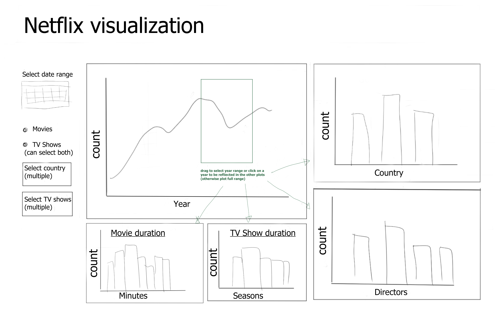

# Netflix Dashboard App

With the advent of OTT platforms, there has been a gradual shift of audience from movie theatres to online viewing. Netflix is a popular online streaming service that wants to ensure that it provides the right selection of films and TV shows to its users. If we could understand which type of movies and series are being produced currently and how it has changed over the years, it would allow streaming services to produce a suitable content catalogue, in line with viewers’ preferences. These factors include but are not limited to the duration of the content, the show directors, country of origin, and the release year of the film/series. 

To address this issue, we built a data visualization dashboard that allows our target audience to visually and interactively explore a database of movies and TV shows to assess the popular content they need to provide to their viewers. This app provides easy access to information related to types of movies and TV shows available on Netflix. This information could be useful to companies providing online streaming services for creating and designing their content catalog. 


## Usage
The link to the app is [here](https://dsci-532-netflixpy.herokuapp.com/)

Usage examples:
- Select genre categories from the side bar to filter the plots by genres.
- Use the slider on the top of the page to view movie and TV show data throughout the years.
- Click on the Movie or TV shows tabs to view plots on movie durations.


## Description
This app contains a landing page that shows the distribution (bar, line or density chart) of the release year, country, director and duration for a movie or TV show.  This app also contains a plot for the number of movies or TV shows over the release year, as well as plots for the number of movies or TV shows for different countries or directors.  Other plots included in this app are plots for the counts of movies or TV shows versus their duration (separate plots for movies and TV shows, where movie duration will be a continuous scale while TV show duration will be a discrete scale).  Users can filter the plots by selecting a date range and selecting to include movies, TV shows, or both by clicking the radial button.  Users also have the option to select multiple countries or directors from dropdown menus for comparison between the number of movies for different countries or directors.  Additionally, by dragging a range of years in the release year plot, users can further filter the country, director, and duration plots to a smaller subset of data reflecting the selected range of years. 


## Dashboard Sketch





## Contributions

1. Anahita Einolghozati
2. Joyce Wang 
3. Rohit Rawat
4. Taiwo Owoseni

Feedback and suggestions are always welcome! Please read [the contributing
guidelines](https://github.com/UBC-MDS/netflixpy_dashboard/blob/main/CONTRIBUTING.md)
to get started.

## Installation
If you would like to help contribute to the app, you can set up the system as follows:
1. Download the necessary packages listed in `requirements.txt` using `pip` or `conda`
2. Clone this repo using `https://github.com/UBC-MDS/netflixpy_dashboard.git`

To run the app locally:
1. Navigate to the root of this repo
2. In the command line, enter

```
python src/app.py
```

3. Copy the address printed out after "Dash is running on" to a browser to view the Dash app.


## Support

If you run into troubles, please [check the issue
list](https://github.com/UBC-MDS/netflixpy_dashboard/issues) to see
if your problem has already been reported or to open new issues.

## Code of conduct

In the interest of fostering an open and welcoming environment, we as contributors and maintainers pledge to making participation in our project and our community a harassment-free experience for everyone, regardless of age, body size, disability, ethnicity, gender identity and expression, level of experience, nationality, personal appearance, race, religion, or sexual identity and orientation. Detailed descriptions
of these points can be found in [`CONDUCT.md`](https://github.com/UBC-MDS/netflixpy_dashboard/blob/main/CONDUCT.md).

## License
The Netflix Dashboard was created by Anahita Einolghozati, Joyce Wang, Rohit Rawat, and Taiwo Owoseni. It is licensed under the terms of the MIT license.
